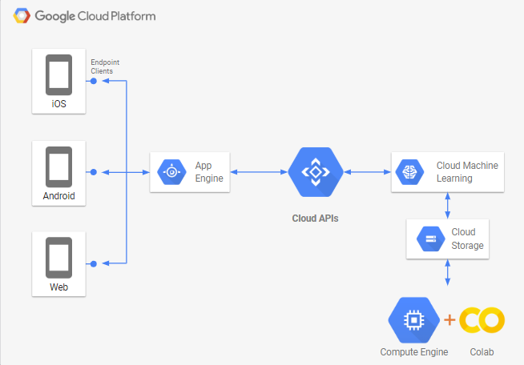
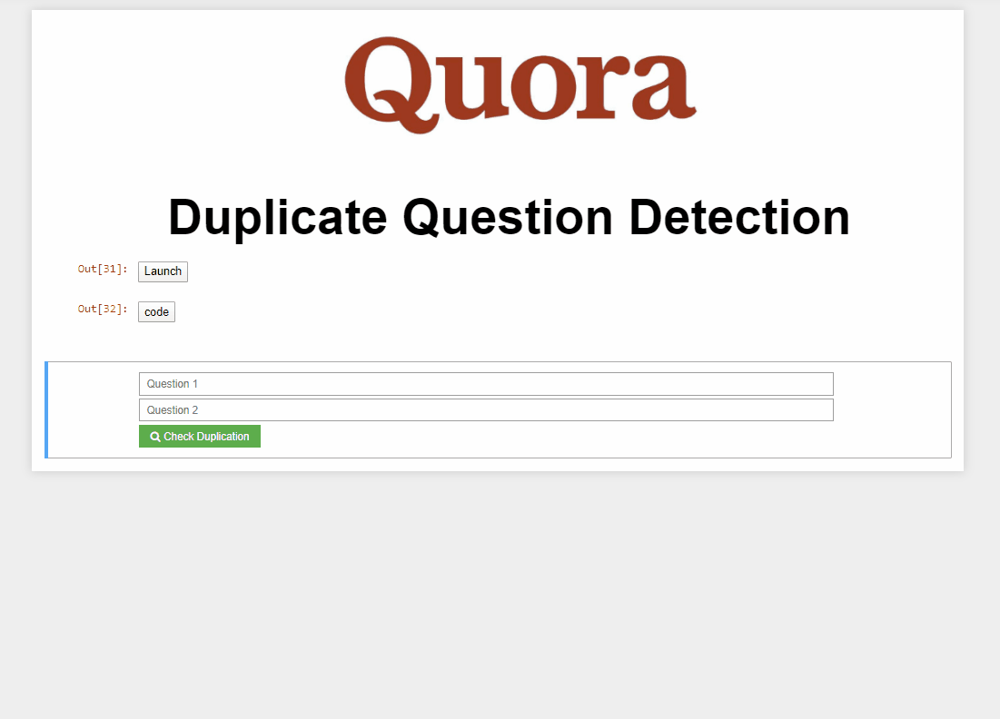

# Quora-duplicate-detection
<!-- {width:200px;} -->

### Detecting duplicate questions using keras and xgboost

Using keras and xgboost to create models which can identify duplicate questions or sentences. The model was trained on a dataset from Quora, using google colab GPU.
Once trained the model was uploaded to GCP cloud storage and deployed on GCP AI platform. 
GCP cloud APIs were used to generate predictions from the deployed model.

A simple interface(shown below) was developed using Jupyter to visualize the model results.

